# Milestone 4 App by Rebecca Johnson
### CST 391

### Links
[Screen Cast Video](https://www.loom.com/share/af0539608453493a9f947870a70dd924?sid=bbf4469e-1931-4618-8f4c-74836d8a2a97), 
[Postman](https://web.postman.co/workspace/My-Workspace~e3ba2104-c355-4bb2-896e-425da88e41b7/documentation/31209245-bdad6218-d250-4358-8d81-b8d7a55c80ee)

## Instructor Feedback
Rebecca, thank you for meeting all requirements on this assignment. 

### Addressing the Feedback
As my assignment meets all the requirements, nothing more was completed to address the feedback.

### Introduce your REST API
The purpose of the API is to access an inventory database and return the entire list or a single 
product. In addition, it should be able to update, add and delete products in the inventory.

| Method        | URL     | Descrition |
|---------------|-----------|------------|
| GET Products  | http://localhost:3000/products     | Returns a list of products in the inventory.       |
| GET product   | http://localhost:3000/products?productId=5 |Returns a specific item in the inventory|
| POST product  | http://localhost:3000/products/addproduct  |Add product to the inventory.       |
| PUT product   | http://localhost:3000/products/updateproduct  |Update product in the inventory.       |
| DELETE product|http://localhost:3000/products/5  |Delete a product in the inventory.       |
| GET Search Results for Vendor |http://localhost:3000/products/product/:search |Searches a term in the vendor name.       |
| GET Search Results for Product Name|http://localhost:3000/products/product/:search | Searches a term in the name.       |

### Introduction
The purpose of this application will be able access the mySQL database with all the available
products in the store. In addition, the user will be able to maintain an inventory for a store by
updating, adding, and removing products from the store. Ideally the application code should
mostly be reusable to create two applications with React and Angular performing the same tasks
outlined in the user stories.

### Design Updates /Bugs
<ul>
  <li>Created API</li>
  <li>Added Way to view Products</li>
  <li>Added a way to delete a product</li>
  <li>Added a way to update products</li>
  <li>Added a way to search products – incomplete [bug]</li>
  <li>Created Application</li>
  <li>Connected API to Application </li>
  <li>Display List of Products  – incomplete [bug]</li>
  <li>Create a product </li>
  <li>Delete a product  – incomplete [bug]</li>
  <li>View a product </li>
  <li>Updated Websites look</li>
</ul>

### Functionality Requirements
<ul>
  <li>As a user I want to view the inventory in a list to see all in the inventory.</li>
  <li>As a user I want to add product details to the inventory, like ID, price and description.</li>
  <li>As a user I want to remove entire products from the inventory list.</li>
  <li>As a user I want to update a product in the inventory such as its quantity.</li>
  <li>As a user, I want to interact with a user-friendly application.</li>
  <li>As a developer, I want to create code that is reusable for both Angular and React versions of the application.</li>
  <li>As a developer, I want to create an application that uses Angular JavaScript Framework.</li>
  <li>As a developer, I want to create an application that uses React JavaScript Framework.</li>
  <li>As a developer, I want to make sure the code is organized and clean.</li>
  <li>As a developer, I want to make sure mySQL database integration is smooth and issue free.</li>
  <li>As a developer, I want to ensure that there is appropriate error handling.</li>
  <li>As a developer, I want to develop the REST APIs developed using Express.</li>
</ul>

### Screenshots
#### ER Diagram
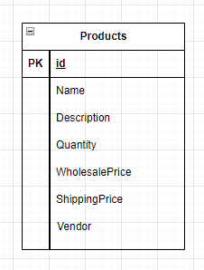
#### Initial UI Sitemap
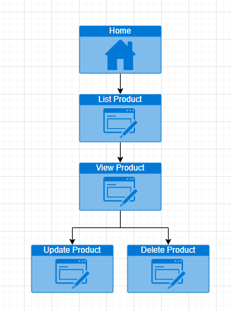
#### Initial UI Wireframes:
   - Home Page  
   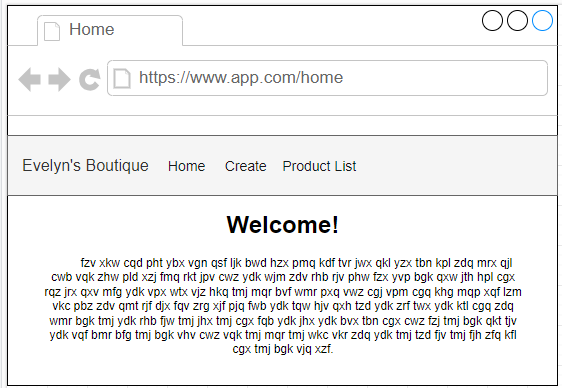
   - View Product 
   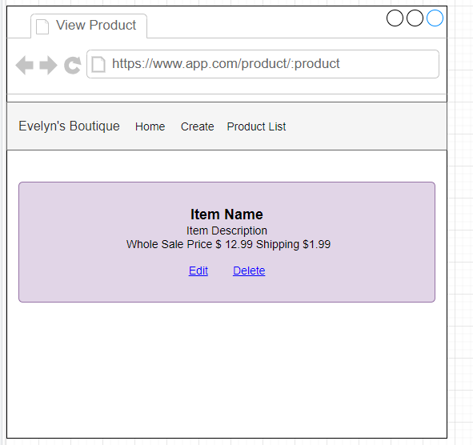
   - Create Page 
   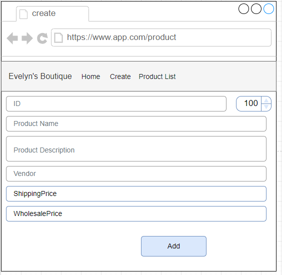
   - List Products 
   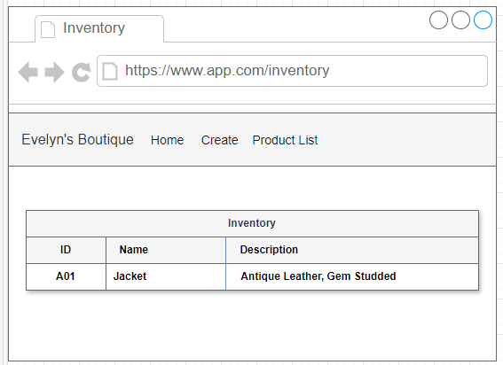

#### Initial UML Classes:
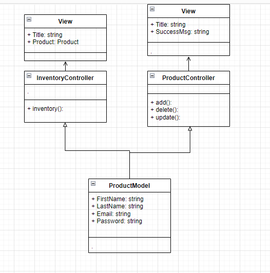

#### Web App ScreenShots
- Home Page
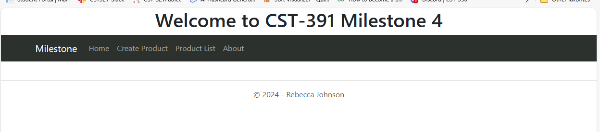
- View Product
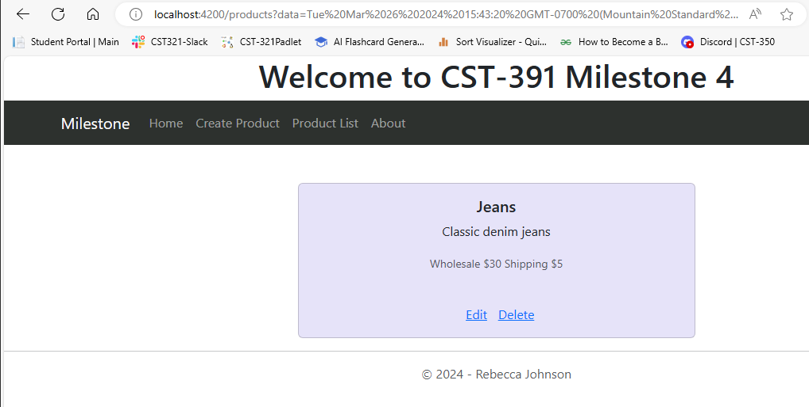
- Create Page

- List Products
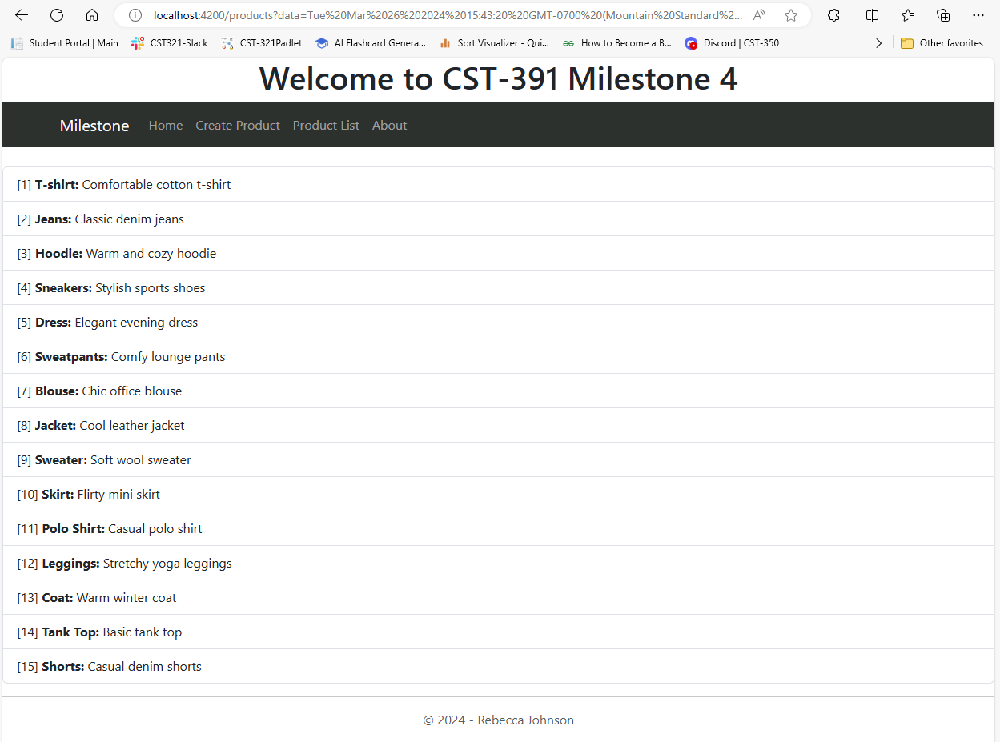
- Delete Products
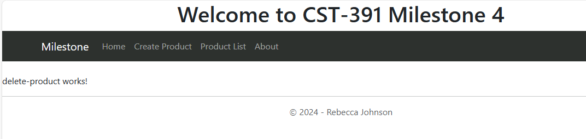

### Risks To Monitor
<ul>
  <li>Data integrity – corruptions, inconsistency, and error</li>
  <li>User access to the database</li>
  <li>Data Security</li>
</ul>

### Powerpoint
[PowerPoint](finalPresentation.pptx)